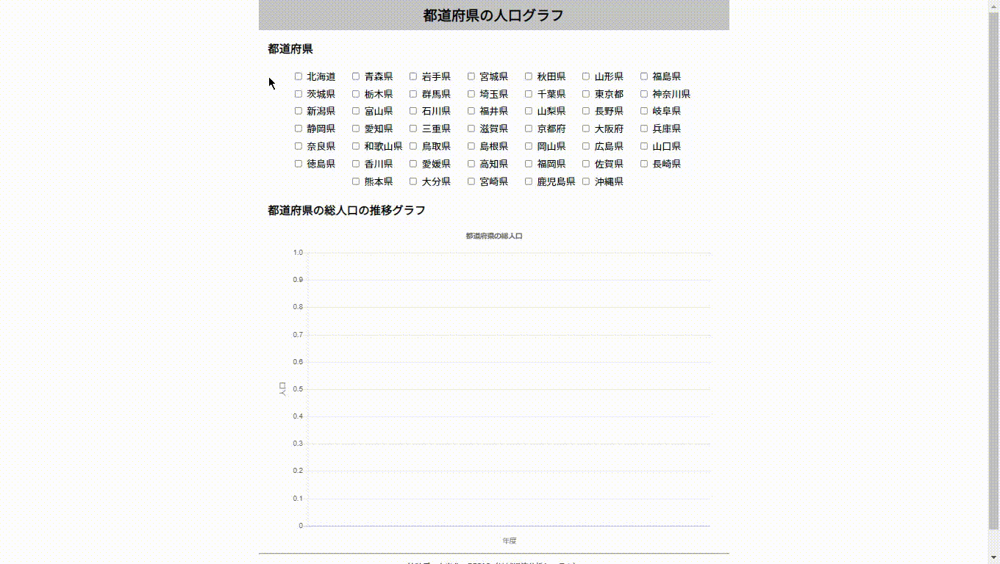

# population-graph

都道府県別の人口を折れ線グラフで表示するプログラムです。\
RESAS APIからデータを取得したデータを用いています。



## サイトURL

[https://masa-dev.github.io/population-graph/](https://masa-dev.github.io/population-graph/)\
（※Google Chrome 推奨）

## 特徴

- 都道府県のチェックボックスを入力することでグラフにデータを表示することが出来ます。
- チェックボックスとデータは連動していて、動的にグラフが変化します。

## API キーの保管

RESASのAPIキーは、セキュリティの観点からAPIキーを記述したファイルを`.gitignore`で管理対象から外しています。

APIキーは以下の形式で保存しています。

- 保存場所：`./apiKey.js`

- 形式：
```javascript
module.exports = {
  resas: {
    name: "X-API-KEY",
    value: "XXXXXXXXXX", // ここにAPIキーを指定する
  },
};
```

## 開発コマンド

開発コマンドはpackage.jsonに記述されています。

開発サーバーの起動
```
npm run serve
```

ビルドファイルの作成
```
npm run build
```

GitHub Pages にデプロイ
```
npm run deploy
```

テストの実行
```
npm run test:unit
```

ESLint と Prettier の実行
```
npm run lint
```

## 使用技術

- Vue CLI
  - Vue.js (バージョン3以降)
  - Vuex
  - Jest
  - ESLint + Prettier
  - SCSS
- Chart.js
  - chartjs-plugin-colorschemes

## 意識したこと

- 機能を作成する際に、ブランチを切るなどしてチーム開発を意識した
- 分岐を1つずつテストすることで、カバレッジ100%を目指した
- 開発の初期に具体的なイメージを作成するために、大まかな設計を考えて作成に取り組んだ
- 公式ドキュメントを読んで出来るだけ仕様を理解したこと
